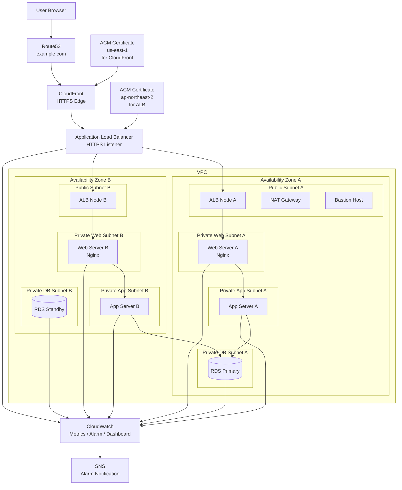

260503(수)
- 프로젝트 개설
- 디렉토리 구성 및 모듈화
- tier-3 도식 수정
- VPC / subnet / IGW / NATGW(eip) 추가

260515 (금)
- network (vpc, subnet)
- security group

```mermaid
flowchart TB
    User[User Browser]

    DNS[Route53<br/>example.com]
    CF[CloudFront<br/>HTTPS Edge]
    ACM1[ACM Certificate<br/>us-east-1<br/>for CloudFront]

    CW[CloudWatch<br/>Metrics / Alarm / Dashboard]
    SNS[SNS<br/>Alarm Notification]

    subgraph VPC[VPC]

        subgraph AZA[Availability Zone A]

            subgraph PublicA[Public Subnet A]
                ALB_A[ALB Node A]
                NAT_A[NAT Gateway]
                Bastion[Bastion Host]
            end

            subgraph PrivateWebA[Private Web Subnet A]
                WebA[Web Server A<br/>Nginx]
            end

            subgraph PrivateAppA[Private App Subnet A]
                AppA[App Server A]
            end

            subgraph PrivateDBA[Private DB Subnet A]
                RDSA[(RDS Primary)]
            end

        end

        subgraph AZB[Availability Zone B]

            subgraph PublicB[Public Subnet B]
                ALB_B[ALB Node B]
            end

            subgraph PrivateWebB[Private Web Subnet B]
                WebB[Web Server B<br/>Nginx]
            end

            subgraph PrivateAppB[Private App Subnet B]
                AppB[App Server B]
            end

            subgraph PrivateDBB[Private DB Subnet B]
                RDSB[(RDS Standby)]
            end

        end

    end

    ALB[Application Load Balancer<br/>HTTPS Listener]
    ACM2[ACM Certificate<br/>ap-northeast-2<br/>for ALB]

    User --> DNS
    DNS --> CF
    CF --> ALB

    ACM1 --> CF
    ACM2 --> ALB

    ALB --> ALB_A
    ALB --> ALB_B

    ALB_A --> WebA
    ALB_B --> WebB

    WebA --> AppA
    WebB --> AppB

    AppA --> RDSA
    AppB --> RDSA

    WebA --> CW
    WebB --> CW
    AppA --> CW
    AppB --> CW
    ALB --> CW
    RDSA --> CW
    RDSB --> CW

    CW --> SNS
```