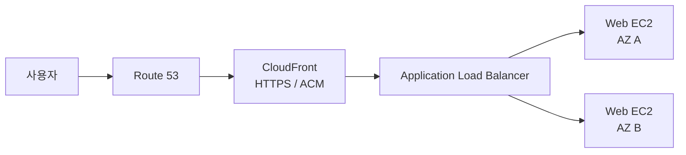
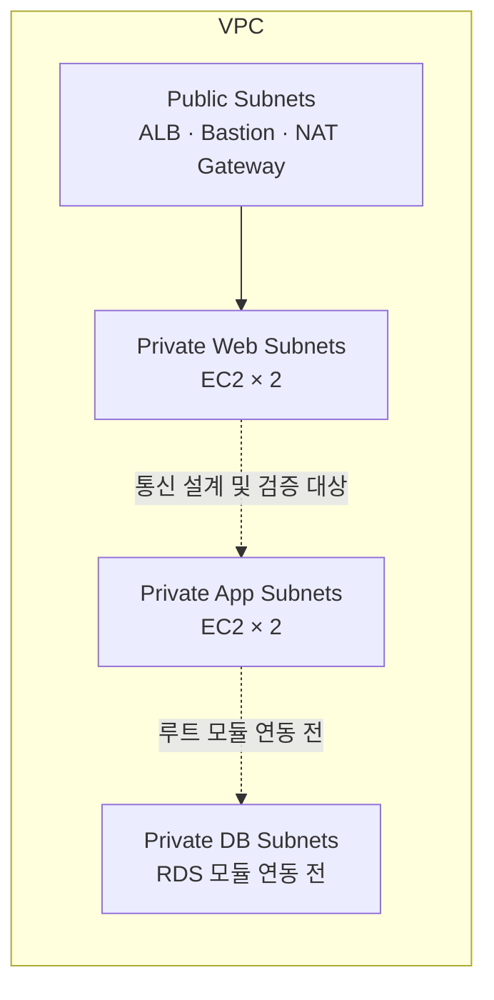

# On-Premise 경험을 AWS 3-Tier 아키텍처로 확장한 기록

> SAN·스토리지 구축과 운영을 하며 익힌 인프라 관점을 AWS와 Terraform으로 옮겨 본 프로젝트입니다.
> 완성된 아키텍처를 그대로 복제하기보다, 리소스를 직접 만들고 연결하고 검증하면서 클라우드의 구조와 운영 기준을 이해하는 데 목적을 두었습니다.

## 프로젝트 한눈에 보기

| 항목 | 내용 |
| --- | --- |
| 출발점 | SAN·스토리지 엔지니어로서의 구축 및 운영 경험 |
| 목표 | 온프레미스의 인프라 관점을 클라우드 아키텍처와 IaC로 확장 |
| 구현 방식 | 먼저 한곳에 구성해 전체 흐름을 이해한 뒤 기능 단위 Terraform 모듈로 분리 |
| 주요 범위 | VPC, EC2, ALB, Route 53, CloudFront, ACM, RDS, CloudWatch, SNS |
| 핵심 경험 | 네트워크 계층 분리, 통신·보안 검증, 반복 배포, 장애 원인 추적 |
| 현재 상태 | Network부터 DNS/CDN까지 루트 모듈 연동, Database와 Observability는 모듈 작성 후 연동 전 |

## 0. 왜 이 프로젝트를 시작했는가

시작은 엔지니어로 직무를 전환하려는 친구에게 제가 현장에서 하던 SAN·스토리지 구축을 설명해 주는 일이었습니다. 리눅스 VM과 `targetcli`를 이용해 스토리지 타깃을 구성하고, 스크립트 단위로 설정 과정을 보여 주었습니다.

이 과정에서 수작업으로 반복하던 인프라 구성을 코드로 선언하고 재현할 수 있는 **Infrastructure as Code**를 알게 되었습니다. 한 대의 서버나 장비를 다루는 것에서 더 나아가 네트워크, 컴퓨팅, 보안, 데이터베이스, 서비스 진입 경로가 연결된 아키텍처 전체를 다루는 일이 흥미로웠습니다.

배우는 과정 자체가 재미있었고, 기존 운영 경험을 바탕으로 DevOps·SRE·Cloud Engineer 영역에서 일하고 싶다는 목표가 생겼습니다. 이 프로젝트는 그 직무 전환을 위해 클라우드 인프라를 직접 더듬어 이해한 기록입니다.

```text
SAN·스토리지 구축 경험
        ↓
Linux VM으로 구축 과정을 설명하고 스크립트화
        ↓
Infrastructure as Code를 접함
        ↓
단일 노드가 아닌 아키텍처 전체에 관심
        ↓
AWS 3-Tier 인프라를 Terraform으로 직접 구현
```

## 1. 무엇을 배우고 싶었는가

현업의 인프라에는 고가용성, 반복 가능한 배포, 장애 탐지와 빠른 복구, 트러블슈팅, 보안과 같은 기능적·비기능적 요구가 함께 존재합니다. 다만 클라우드를 처음 배우는 단계에서 이러한 요구를 안다고 말하는 것과, 실제로 고려하여 설계하는 것은 다르다고 생각했습니다.

예를 들어 `DNS → CloudFront → ALB → 2대의 EC2` 구성을 보고 고가용성을 적용했다고 설명할 수는 있습니다. 그러나 더 중요한 것은 왜 그런 구조가 사용되는지, 어떤 장애와 운영 조건을 해결하는지, AWS의 제약과 표준은 무엇인지를 직접 확인하며 익히는 일이었습니다.

그래서 처음부터 완성도 높은 결과물을 만드는 것보다 다음 세 가지를 우선했습니다.

1. **온프레미스에서 하던 일을 클라우드에서 다시 찾기**
   네트워크 경로, 노드 간 통신, 접근 제어, 상태 확인처럼 환경이 달라도 통용되는 인프라의 흐름을 확인했습니다.

2. **클라우드에만 있는 개념과 표준 익히기**
   VPC, Subnet, Security Group, Internet Gateway, NAT Gateway, Elastic IP, Availability Zone 등 AWS의 구성 요소가 어떤 관계로 동작하는지 직접 연결했습니다.

3. **목표 직무에서 요구하는 운영 범위 경험하기**
   DevOps·SRE·Cloud Engineer 채용 요건과 사례를 참고해 ECS/EKS와 같은 컨테이너 영역, 모니터링, DNS/CDN, 데이터베이스 등 이후 학습해야 할 범위를 파악하고, 우선 3-Tier 기반 리소스부터 구축했습니다.

이 프로젝트의 목표는 ‘혼자서 모든 것을 이미 할 수 있는 사람’처럼 보이는 것이 아닙니다. 제가 만든 구조를 기준점으로 삼아 현업의 요구와 선배 엔지니어의 설명을 더 빠르게 이해하고, 피드백을 실제 작업에 반영할 수 있는 **잘 리드받을 수 있는 상태**를 갖추는 것이었습니다.

## 2. 어떻게 구현했는가

### 전체 흐름을 먼저 만들었다

처음부터 모듈 구조를 완벽하게 설계하지 않았습니다. 리소스가 어떤 순서로 만들어지고 어떤 값으로 연결되는지 빠르게 파악하기 위해 먼저 한곳에 구성했습니다. 이후 루트 모듈이 각 구성 요소를 조합한다는 Terraform의 구조를 이해하면서 Network, Security, Compute, ALB, DNS/CDN 등의 기능 단위로 분리했습니다.

모듈화 자체보다 **전체를 직접 연결해 본 뒤 경계를 나누는 과정**이 중요했습니다. 그 과정을 통해 입력 변수, 출력값, 리소스 간 의존성이 왜 필요한지 이해할 수 있었습니다.

### 코드를 직접 입력하며 더듬어 이해했다

초기에는 예시 코드의 도움을 받되, 코드를 직접 입력하고 값을 바꿔 보았습니다. 하드코딩으로 시작하더라도 제가 온프레미스에서 하던 설정과 비교하면서 다음 흐름을 하나씩 확인했습니다.

- OS가 올라갈 위치와 네트워크 대역 정의
- Public·Web·App·DB Subnet 분리
- Internet Gateway, NAT Gateway, Route Table을 통한 경로 연결
- Bastion, Web, App EC2 배치와 Security Group 적용
- `user_data`를 이용한 Nginx 설치 및 테스트 페이지 구성
- ALB Target Group 등록과 Health Check 설정
- Route 53, ACM, CloudFront를 연결한 외부 요청 경로 구성

`terraform apply`가 끝나야 `user_data`까지 실행되어 인스턴스가 의도한 상태가 된다는 점처럼, 선언한 코드와 실제 리소스의 동작 사이도 확인했습니다.

### 익숙한 검증 방법에서 출발했다

구축 후에는 온프레미스에서 하던 것처럼 먼저 통신 여부를 확인했습니다. 노드와 계층 사이의 경로를 따라가며 Ping, SSH, HTTP 요청, ALB Health Check를 확인했고, 테스트 애플리케이션의 응답은 `200 OK`, 생성 요청은 `201 Created`와 같이 기대한 상태 코드가 반환되는지를 기준으로 검증했습니다.

### 보안과 장애를 변수 단위로 좁혔다

Security Group의 허용 주체와 포트, Route Table, Public IP 유무처럼 통신에 영향을 주는 조건을 하나씩 바꿔 보았습니다. 문제가 생기면 여러 설정을 동시에 고치기보다 변인을 하나씩 변경하면서 원인을 좁혔습니다.

이 과정을 반복하며 다음과 같은 감각을 익혔습니다.

- 패킷이 어느 계층까지 도달했는지 확인하는 순서
- 네트워크 경로 문제와 서비스 프로세스 문제를 구분하는 방법
- CIDR 기반 허용과 Security Group 참조 방식의 차이
- ALB가 정상 인스턴스를 판단하는 기준
- Terraform 코드, AWS 리소스 상태, OS 내부 설정을 함께 확인하는 방법

### 본업에 대한 책임을 유지했다

이 학습은 기존 회사의 업무를 소홀히 하면서 진행한 별도의 활동이 아닙니다. 고객사 업무와 이동 일정을 우선했고, 용인까지 왕복하는 지하철이나 업무가 끝난 뒤의 시간을 활용해 코드를 작성하고 검증했습니다. 새로운 직무를 준비하는 과정에서도 현재 맡은 업무에 대한 책임을 지키는 것을 중요한 원칙으로 두었습니다.

## 3. 무엇을 검증했고, 무엇을 얻었는가

### 구현 및 검증 범위

| 영역 | 직접 구현하거나 확인한 내용 | 현재 코드 상태 |
| --- | --- | --- |
| Network | VPC, 2개 AZ, Public·Web·App·DB Subnet, IGW, NAT Gateway, Route Table | 루트 모듈 연동 |
| Security | ALB·Bastion·Web·App·DB Security Group과 계층별 허용 관계 | 루트 모듈 연동 |
| Compute | Bastion, AZ별 Web/App EC2, Web 서버 `user_data` | 루트 모듈 연동 |
| Load Balancing | ALB, Target Group, EC2 등록, HTTP Health Check | 루트 모듈 연동 |
| DNS / CDN / TLS | Route 53 Hosted Zone·Alias, ACM DNS 검증, CloudFront HTTPS | 루트 모듈 연동 |
| Database | RDS MySQL, DB Subnet Group, Multi-AZ 설정 | 모듈 작성, 루트 연동 전 |
| Observability | ALB·EC2·RDS Alarm, SNS 알림, CloudWatch Dashboard | 모듈 작성, 루트 연동 전 |

### 이 프로젝트를 통해 얻은 역량

- AWS 리소스를 개별 서비스가 아니라 요청과 통신의 흐름으로 보는 관점
- Terraform 변수와 출력값을 이용해 모듈 간 의존성을 연결하는 경험
- Public/Private 경계와 Web/App/DB 계층을 나누는 기본 네트워크 설계 경험
- Security Group, Routing, 서비스 상태를 순서대로 확인하는 트러블슈팅 방식
- 반복 작업을 코드로 남기고 다시 실행 가능한 형태로 만드는 습관
- 고가용성, 보안, 관측성을 단순한 용어가 아니라 확인해야 할 운영 조건으로 보는 관점

가장 큰 결과는 AWS 서비스를 많이 나열할 수 있게 된 것이 아닙니다. 온프레미스에서 하던 구축과 검증 방식을 클라우드에서도 다시 수행해 보면서, 새로운 아키텍처를 접했을 때 기존 경험과 연결해 이해할 수 있는 기준이 생긴 것입니다.

## 4. 어디까지 만들고 멈췄는가

현재 루트 모듈에는 다음 요청 경로가 연결되어 있습니다.



VPC 내부에는 2개 Availability Zone에 걸쳐 Public, Web, App, DB Subnet을 만들고 Bastion과 Web/App EC2를 배치했습니다. RDS, CloudWatch Alarm, SNS, Dashboard도 별도 모듈로 작성했지만 루트 모듈 연결과 End-to-End 검증 전 단계에서 멈췄습니다.



그 이유는 프로젝트의 목적이 ‘혼자 방에서 같은 배포를 몇백 번 반복하는 것’에 있지 않았기 때문입니다. 실제 고객사의 요구사항, 변경 절차, 비용과 보안 정책, 장애 상황, 여러 직군 사이의 협업이 더해져야 아키텍처 설계는 현실의 경험이 됩니다. 개인 환경에서 표준 구조를 구현하는 것으로 기본 판을 깔 수는 있지만, 그 위에서 어떤 선택을 해야 하는지는 실제 요구와 팀의 리뷰 속에서 배워야 합니다.

따라서 이 프로젝트의 종료 지점은 완벽한 완성이 아니라 다음 단계로 넘어갈 수 있는 기준을 확보한 시점입니다.

- 아키텍처 그림을 보았을 때 주요 리소스와 통신 경로를 설명할 수 있다.
- 코드와 실제 리소스를 비교하며 문제 지점을 좁힐 수 있다.
- 설계 결정에 대해 ‘왜 이렇게 구성했는가’를 질문할 수 있다.
- 현업의 요구와 피드백을 받아 기존 구성을 수정할 준비가 되어 있다.

내부망은 하나의 기반 위에 올라간 여러 노드가 정해진 경로와 규칙에 따라 통신하는 구조라는 점에서 온프레미스와 클라우드가 닮아 있었습니다. AWS에서는 그 기반과 경계를 VPC, Subnet, Route Table, Security Group 같은 리소스로 더 명시적으로 표현한다는 차이가 있었습니다. 이 연결점을 발견한 것이 이번 프로젝트에서 얻은 가장 중요한 성과입니다.

## 기술 구성

- **Cloud**: AWS VPC, EC2, ALB, RDS, Route 53, CloudFront, ACM, CloudWatch, SNS
- **IaC**: Terraform 1.5.6 이상, AWS Provider 5.x
- **OS / Web**: Amazon Linux 계열 AMI, Nginx
- **Architecture**: 3-Tier, Multi-AZ, Public/Private Network Segmentation

## 디렉터리 구조

```text
.
├── terraform/              # 루트 모듈과 환경별 입력값
│   ├── main.tf
│   ├── variables.tf
│   ├── outputs.tf
│   ├── provider.tf
│   └── versions.tf
└── modules/
    ├── network/            # VPC, Subnet, Routing, NAT Gateway
    ├── security/           # 계층별 Security Group
    ├── compute/            # Bastion, Web/App EC2
    ├── alb/                # ALB, Target Group, Health Check
    ├── database/           # RDS MySQL Multi-AZ
    ├── hosted_zone/        # Route 53 Hosted Zone
    ├── dns_validation/     # ACM DNS 검증 레코드
    ├── dns_alias/          # CloudFront Alias 레코드
    ├── acm/                # TLS 인증서
    ├── cdn/                # CloudFront Distribution
    ├── monitoring/         # CloudWatch Alarm, SNS
    └── dashboard/          # CloudWatch Dashboard
```

## 실행 전 확인 사항

- AWS 자격 증명과 Terraform 실행 환경이 필요합니다.
- `terraform/terraform.tfvars`에 환경에 맞는 CIDR, AMI, 도메인, 이메일 등의 값을 설정해야 합니다.
- 비밀번호와 같은 민감 정보는 저장소에 커밋하지 않고 환경 변수 또는 별도의 Secret 관리 방식을 사용해야 합니다.
- NAT Gateway, RDS, Route 53, CloudFront 등의 리소스는 AWS 비용이 발생할 수 있습니다.

```bash
cd terraform
terraform init
terraform fmt -check -recursive
terraform validate
terraform plan
```

`terraform apply`는 Plan 결과와 예상 비용을 확인한 뒤 실행합니다.

## 다음 단계

- Database, Monitoring, Dashboard 모듈의 루트 모듈 연동과 End-to-End 검증
- Auto Scaling Group을 이용한 Web/App 계층 복구 및 확장 자동화
- S3 Backend와 상태 잠금을 이용한 Terraform State 원격 관리
- GitHub Actions 기반 `fmt`, `validate`, `plan` 자동 검증
- Systems Manager Session Manager 도입을 통한 Bastion·SSH 의존성 축소
- CloudWatch Agent와 로그 수집을 통한 관측성 확장
- 백업·복구 절차와 장애 대응 Runbook 작성 및 복구 시나리오 검증
